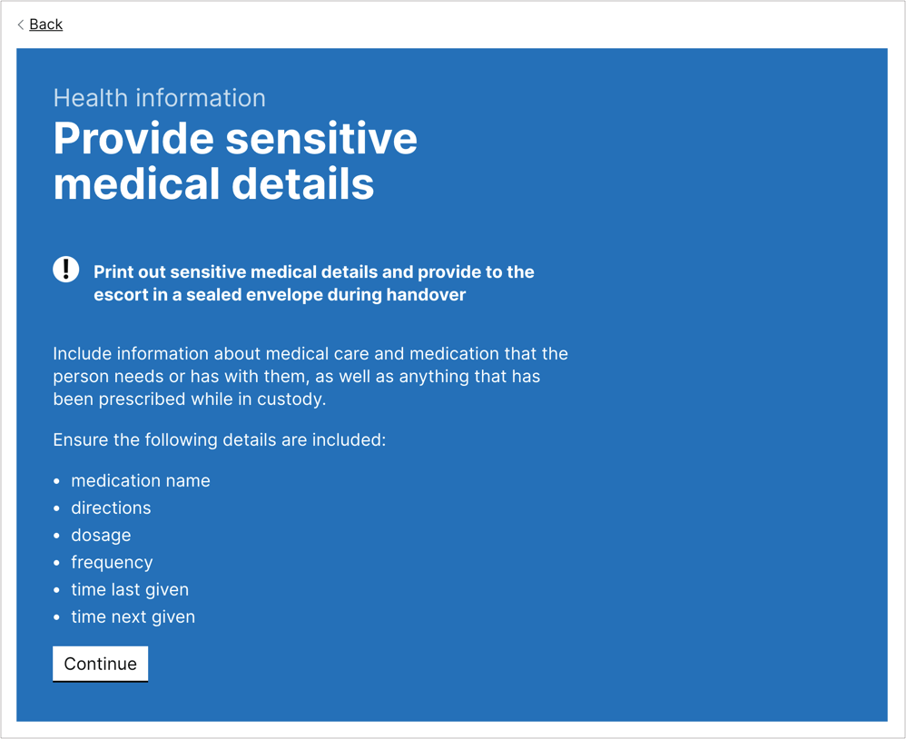

# Book a secure move frameworks

YAML definitions of the [Book a secure move](https://github.com/ministryofjustice/hmpps-book-secure-move) service frameworks.

The repository contains the following frameworks:

- [Person Escort Record (PER)](./frameworks/person-escort-record)
- [Youth Risk Assessment](./frameworks/youth-risk-assessment)

# Framework Assessments

Each framework contains a set of YAML definitions that will be used by the [Book a secure move API](https://github.com/ministryofjustice/hmpps-book-secure-move-api)
and [client applications](https://github.com/ministryofjustice/hmpps-book-secure-move-frontend) of the API to generate validation and form journeys.

## Manifest files

A manifest is a list of sections in the assessment defined as a tree-like structure. Each manifest file contains definitions of the steps and the questions that are required to be answered within each section.

Manifest files should live in `manifests/` and be stored in a flat structure. File names must use lower kebab casing, for example `file-name.yml`.

### Manifest options

- `name` **(required)** - name of the section. Used for the step heading caption.
- `steps` - a list of steps for this section. See [steps documentation](#steps) for options.
- `order` - order in which to display the sections in a summary or a task list

## Steps

Steps define a form page within a particular section. A section can be made up of multiple steps.

### Step options

- `name` **(required)** - the name of the step. Used for the page heading.
- `slug` **(required)** - the URL section for this step
- `questions` **(required)** - list of questions to ask on this step and in what order. Each item should match the filename of the question. See [questions documentation](#questions) for question options.
- `type` - display different styles for a particular step. See [step types](#step-types) for support types.
- `content_before_questions` - content to appear before the questions on this step. Supports [markdown](#markdown-support).
- `content_after_questions` - content to appear after the questions on this step. Supports [markdown](#markdown-support).
- `next_step` - can be used to override the following step or to [define complex step based logic](#next-steps). Value should match the `slug` property.

#### Step types

The `type` options allows the use of different types of layout for a step. Not passing this option will use the default layout.

- `interruption-card` - display the step using a blue background, instructions and a "Continue" button instead of "Save and continue". Usually used to define offline process during an online journey.

  

#### Next steps

The `next_step` value for a step can be a relative URL within that journey or an array of conditional steps. Each conditional `next_step` can contain a next location, a question name, operator and value.

```yaml
steps:
  -
    name: Step 1
  -
    name: Step 2
    next_step:
      # an object defining a field and expected value
      -
        question: question1
        value: Yes
        next_step: conditional-next-step
      # an object defining a field, operator and expected value based on operator
      -
        question: question2
        op: '==='
        value: Yes
        next_step: conditional-next-step
      # default can be a string
      - default-next-step
```

## Questions

Questions define the way in which to gather a piece of information. Questions can be nested using followup questions on a parent
question and can contain dependency logic to define whether a question should only be answered if another question is answered
in a particular way.

Question files should live in `questions/` and be stored in a flat structure. File names must use lower kebab casing, for example `file-name.yml`.

### Question options

- `type` **(required)** - the [type of question](#question-types) input. Current supported types: `radio`, `checkbox`, `text`, `textarea`, `add_multiple_items`
- `question` **(required)** - the full text of the question, usually including a question mark, that should be displayed in forms and summary tables.
- `list_item_name` - text to display in the "Add another ..." button and item names, for questions with type [`add_multiple_items`](#question-types). Should be defined as a singular noun.
- `questions` - list of questions to display relating to a single item, for questions with type [`add_multiple_items`](#question-types)
- `hint` - hint text to display after the question, usually for advice on how to format an answer. Supports [markdown](#markdown-support).
- `description` - text to display as the summary table row heading for this question. If not supplied, will use `question` value
- `display` - list of further display styles for question input
  - `rows` - the number of rows to display for `textarea` questions
  - `character_width` - the character width of a question input. Helps to make the input the right size for the content its intended for. Supported values: `20`, `10`, `5`, `4`, `3`, `2`.
  - `prefix` - text or characters to be used before the field. Only applies to `text` fields.
  - `suffix` - text or characters to be used after the field. Only applies to `text` fields.
- `nomis_mappings` - list of NOMIS codes representing NOMIS alerts, assessments, personal care needs and reasonable adjustments mapped to a question, to display on questions.
  - `code` **(required)** - the code of the NOMIS resource
  - `type` **(required)** - the type of NOMIS resource. Current supported types for NOMIS mappings: `alert`, `assessment`, `personal_care_need` and `reasonable_adjustment`
- `nomis_fallback_mappings` - list of NOMIS code types that will fallback to a question if they are not mapped to any other question.
  - `type` **(required)** - the type of NOMIS resource. Current supported types for NOMIS mappings: `alert`, `assessment`, `personal_care_need` and `reasonable_adjustment`
- `prefill` - indicates if a question's response should be populated by the previously completed assessment. If there is no previous record or the question does not exist in the previous record the response will be left empty. Accepted values are `true` or `false`.
- `options` - for question types that require answers to be within a particular set of items. Usually for radios and checkboxes
  - `label` **(required)** - text displayed on the option label
  - `value` - value submitted to the server, defaults to value of `label`
  - `hint` - hint text displayed after the option label, usually for advice on this option. Supports [markdown](#markdown-support).
  - `followup` - list of questions to conditionally display if this question is answered with this value. This will add this question as a dependent question dynamically to any followup questions and include them in the step where this question is defined.
  - `followup_comment` - allow for a text box input to be displayed conditionally if a specific value from a question has been selected
    - `label` **(required)** - text displayed on the text box label
    - `type` - the [type of question](#question-types) input. Current supported types for followup comments: `text`, `textarea`
    - `hint` - hint text to display after the label, usually for advice on how to format an answer. Supports [markdown](#markdown-support).
    - `display` - list of further display styles for question input
      - `rows` - the number of rows to display for `textarea` questions
      - `character_width` - the character width of a question input. Helps to make the input the right size for the content its intended for. Supported values: `20`, `10`, `5`, `4`, `3`, `2`.
      - `prefix` - text or characters to be used before the field. Only applies to `text` fields.
      - `suffix` - text or characters to be used after the field. Only applies to `text` fields.
    - `validations` - list of [validations](#question-validation) that need to be applied to this text box
      - `type` **(required)** - the validation error key
      - `message` - custom text that will be displayed in the form
  - `flags` - list of flags to conditionally display on summary pages as alerts if this question is answered with this value.
    - `type` **(required)** - the type of the flag to display. Current supported types: `information`, `attention`, `warning`, `alert`
    - `label` **(required)** - text displayed on the flag label
- `validations` - list of [validations](#question-validation) that need to be applied to this question
  - `type` **(required)** - the validation error key
  - `message` - custom text that will be displayed in the form

#### Question types

Supported types:

- `text` - renders a text form element.
- `textarea` - renders a textarea form element.
- `radio` - renders a radio form element. Radio items are defined under `options`.
- `checkbox` - renders a checkbox form element. Checkbox items are defined under `options`.
- `add_multiple_items` - allows a set of questions to be grouped and repeated within a list item. Child questions to display in each group are defined under `questions`. The noun for the item is defined under `list_item_name` in singular form.

#### Question validation

Validations are defined as an object containing a validation type (`type`) and a message (`message`) to display if the response doesn't pass that validation.

Supported validations:

- `required` - mark a question as mandatory. For radios or checkboxes it will require at least one option to be selected, for text or textarea questions it will require at least 1 character, for add_multiple_items it will require at least 1 item.
- `required_unless_nomis_mappings` - mark a text or textarea as mandatory, where it will require at least 1 character. If there are NOMIS mappings attached to the response, this will become optional. This validation only applies to the `followup_comment` option

## Markdown support

In some places of the framework we support basic [markdown formatting](https://github.com/adam-p/markdown-here/wiki/Markdown-Cheatsheet) and some additional syntax for custom components:

- **[Inset text component](https://design-system.service.gov.uk/components/inset-text/)**

  Start the text you wish to wrap with `!!! inset` and end it with `!!!`. For example:

  ```markdown
  !!! inset
  Text to be displayed within indentation
  !!!
  ```

- **[Warning text component](https://design-system.service.gov.uk/components/warning-text/)**

  Start the text you wish to wrap with `!!! warning` and end it with `!!!`. For example:

  ```markdown
  !!! inset
  Text to be displayed with warning symbol
  !!!
  ```

## Creating a new release

1. Checkout and pull the latest version of master
1. Increase the version property using the [`npm version`](https://docs.npmjs.com/cli/version) command. Follow [semantic versioning](https://semver.org/) for version numbers. This will create the git version commit and tag associated to the new version as well.
1. Increase the version number in the package.json `name` property to match the new version. This is to support the method needed to cater for multiple versions of the framework in the [frontend project](https://github.com/ministryofjustice/hmpps-book-secure-move-frontend/blob/d374ac9e46f0e258ec2a9fa1bbc9a7df2fb81cc4/package.json#L70-L71).
1. Push the commit to the remote server (`git push`)
1. Push tags to remote (`git push --tags`)
1. Create a [release manually](https://github.com/ministryofjustice/hmpps-book-secure-move-frameworks/releases/new)
1. You then need to run `bundle exec rake frameworks:populate_data` in the [Book a secure move API](https://github.com/ministryofjustice/hmpps-book-secure-move-api) K8 environments in order for the new framework to be seeded into the database.

## Linting

We use [yamllint] to lint the YAML files. [Once installed][yamllint-installation], you can check all the files are linted correctly by running:

```shell
$ yamllint .
```

[yamllint]: https://yamllint.readthedocs.io/en/stable/index.html
[yamllint-installation]: https://yamllint.readthedocs.io/en/stable/quickstart.html#installing-yamllint
